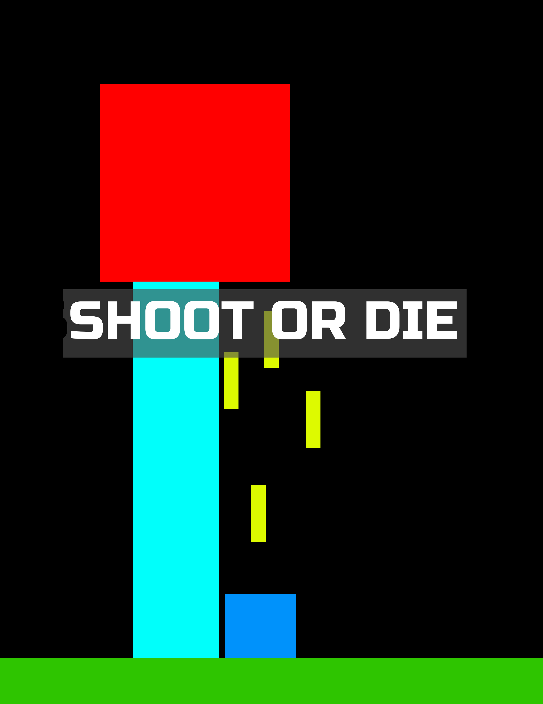
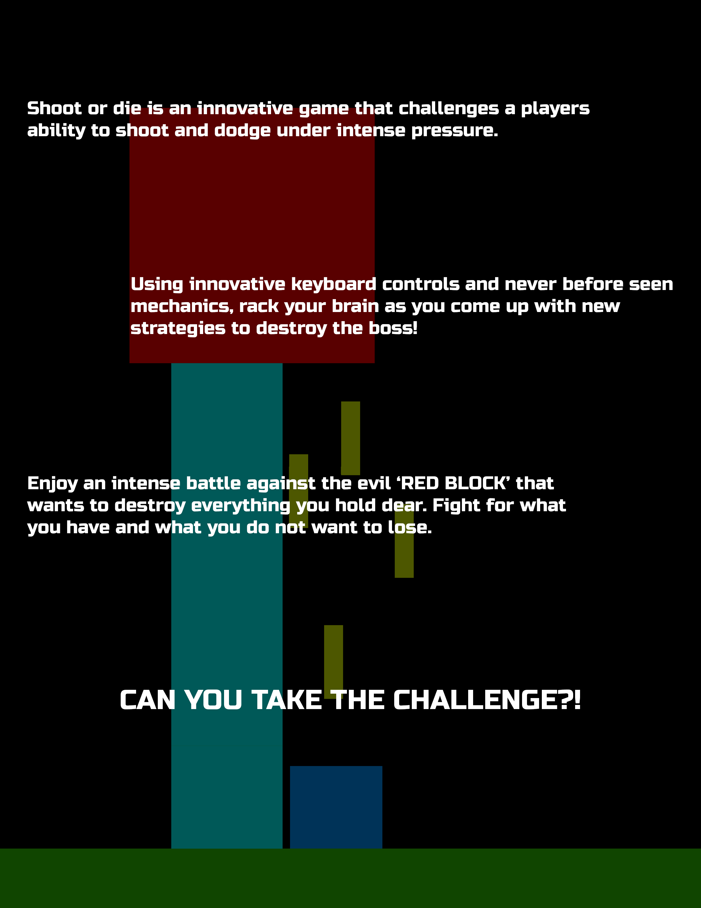

# Kill-The-Blokk // Shoot or Die
This is a small game I made in gr.10 (2019) for my high school computer science class; the game was coded in python using the pygame library. I don't really like the previous name of "Shoot or Die", so I've started calling it "Kill The Blokk" despite the cover image still having "Shoot or Die" sorry for the confusion.

This is one of the first fully original games, and it turned out pretty well. The goal of the game is to kill the big bad (>.<) red blokk by shooting it, all the while dodging the blue lasers that will be shooting at you.

My favourite feature of this game is the way you can move off one side of the screen and appear at the other. I coded this all originally, so I was super proud when I finally got the mechanism to work.

Controls: Spacebar to shoot and arrows keys to move, jump, and fall through platforms.

Although this game was coded using an old version of python and pygame, it still works fine on newer versions (I ran it on python 3.8.5 and pygame 2.1.0)

